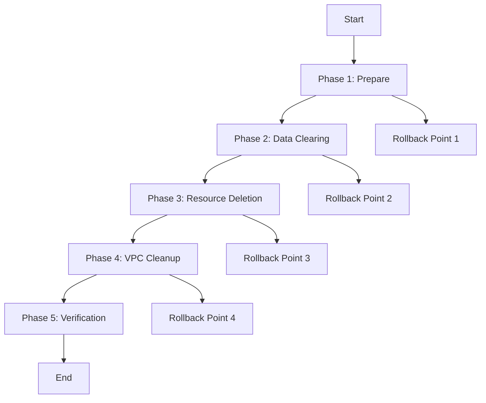

# HIPAA Infrastructure Cleanup Refactoring Plan

## Overview
This plan refactors 5 separate cleanup scripts into a single, unified cleanup system with modular design, phase-based execution, and comprehensive validation.

## Current State Analysis
- **5 scripts** with significant overlap and duplicate functionality
- **Inconsistent** command-line interfaces and error handling
- **Redundant** AWS resource discovery and deletion logic
- **Missing** standardization across environments

## Target Architecture

### Unified Script: `hipaa-cleanup.sh`
Single entry point with modular subsystems:

```
hipaa-cleanup.sh
├── lib/
│   ├── aws-cleanup.sh      # AWS resource cleanup modules
│   ├── pulumi-cleanup.sh   # Pulumi stack management
│   ├── verification.sh     # Resource verification
│   └── utils.sh           # Shared utilities
├── config/
│   ├── environments.yaml  # Environment configurations
│   └── resource-maps.yaml # AWS resource mappings
└── phases/
    ├── phase1-prepare.sh  # Pre-cleanup preparation
    ├── phase2-data.sh     # Data clearing (RDS, S3)
    ├── phase3-resources.sh # Resource deletion
    ├── phase4-vpc.sh      # VPC cleanup
    └── phase5-verify.sh   # Final verification
```

## Implementation Phases

### Phase 1: Analysis & Architecture (2-3 hours)
**Priority: High**
- [ ] Complete functionality mapping across all scripts
- [ ] Identify unique features from each script
- [ ] Design modular architecture
- [ ] Create unified CLI interface specification

### Phase 2: Core Module Development (4-5 hours)
**Priority: High**
- [ ] Implement shared utility functions
- [ ] Create AWS resource discovery module
- [ ] Build Pulumi integration layer
- [ ] Develop verification system

### Phase 3: Cleanup Engine Implementation (3-4 hours)
**Priority: High**
- [ ] Implement phase-based execution system
- [ ] Add dependency resolution (security groups, ENIs)
- [ ] Create rollback capabilities
- [ ] Build progress tracking

### Phase 4: Configuration & Integration (2-3 hours)
**Priority: Medium**
- [ ] Environment configuration system
- [ ] Makefile integration
- [ ] Docker compatibility
- [ ] CI/CD pipeline updates

### Phase 5: Testing & Validation (2-3 hours)
**Priority: Medium**
- [ ] Comprehensive test suite
- [ ] Dry-run capabilities
- [ ] Validation checks
- [ ] Documentation

## Feature Consolidation Matrix

| Feature | comprehensive | enhanced | force | final | smart | Unified |
|---------|---------------|----------|-------|-------|-------|---------|
| S3 Bucket Emptying | ✅ | ✅ | ✅ | ✅ | ❌ | ✅ |
| RDS Data Clearing | ✅ | ✅ | ❌ | ❌ | ❌ | ✅ |
| Load Balancer Protection | ✅ | ✅ | ❌ | ❌ | ❌ | ✅ |
| VPC Cleanup | ✅ | ✅ | ✅ | ❌ | ✅ | ✅ |
| Security Group Dependencies | ✅ | ✅ | ❌ | ❌ | ✅ | ✅ |
| Pulumi Stack Cleanup | ✅ | ✅ | ❌ | ❌ | ✅ | ✅ |
| ECS Resource Cleanup | ✅ | ✅ | ✅ | ❌ | ✅ | ✅ |
| Verification Reports | ✅ | ✅ | ❌ | ✅ | ❌ | ✅ |
| Environment Configuration | ✅ | ✅ | ❌ | ❌ | ✅ | ✅ |
| Force Mode | ✅ | ✅ | ✅ | ❌ | ❌ | ✅ |
| Dry Run Mode | ❌ | ❌ | ❌ | ❌ | ❌ | ✅ |
| Rollback Capability | ❌ | ❌ | ❌ | ❌ | ❌ | ✅ |

## Unified CLI Interface

```bash
# Basic usage
./hipaa-cleanup.sh [environment] [options]

# Examples
./hipaa-cleanup.sh dev --phase=all --verify
./hipaa-cleanup.sh staging --phase=data --dry-run
./hipaa-cleanup.sh prod --force --skip-verification

# Options
--phase=[prepare|data|resources|vpc|verify|all]
--environment=[dev|staging|prod]
--force                    # Skip confirmations
--dry-run                  # Show what would be done
--verify                   # Run verification after
--skip-phase=[phase-name]  # Skip specific phases
--rollback=[timestamp]     # Rollback to previous state
--config=[file]           # Custom configuration
```

## Makefile Integration

### New Makefile Targets

```makefile
# Cleanup commands
cleanup-dev:
	./scripts/hipaa-cleanup.sh dev --phase=all --verify

cleanup-staging:
	./scripts/hipaa-cleanup.sh staging --phase=all --verify

cleanup-prod:
	./scripts/hipaa-cleanup.sh prod --phase=all --verify

cleanup-dry-run:
	./scripts/hipaa-cleanup.sh $(ENV) --dry-run

cleanup-force:
	./scripts/hipaa-cleanup.sh $(ENV) --force

cleanup-rollback:
	./scripts/hipaa-cleanup.sh $(ENV) --rollback=$(TIMESTAMP)

# Legacy compatibility (deprecated, will be removed in v2.0)
cleanup-legacy:
	@echo "Deprecated: Use 'make cleanup-$(ENV)' instead"
	@./scripts/hipaa-cleanup.sh $(ENV) --legacy-support
```

## Migration Strategy

### Step 1: Backward Compatibility (Week 1)
- Create symlink from old script names to new unified script
- Add `--legacy-support` flag for old behavior
- Update documentation with migration warnings

### Step 2: Gradual Transition (Week 2-3)
- Mark old scripts as deprecated
- Add deprecation warnings
- Update CI/CD pipelines
- Train team on new interface

### Step 3: Full Migration (Week 4)
- Remove old scripts
- Update all documentation
- Archive old scripts in git history

## Technical Specifications

### Environment Configuration
```yaml
# config/environments.yaml
environments:
  dev:
    aws_profile: dev-root
    region: us-east-1
    force_mode: true
    skip_verification: false
    
  staging:
    aws_profile: staging-root
    region: us-east-1
    force_mode: false
    skip_verification: false
    
  prod:
    aws_profile: prod-root
    region: us-east-1
    force_mode: false
    skip_verification: false
```

### Resource Mapping
```yaml
# config/resource-maps.yaml
resources:
  aws:
    s3:
      patterns: ["hipaa-*", "*cloudtrail*", "*dev*"]
      empty_versions: true
      lifecycle_policy: true
    
    rds:
      patterns: ["hipaa-*"]
      clear_data: true
      skip_snapshot: true
    
    load_balancers:
      patterns: ["hipaa-*", "*dev*", "*staging*", "*prod*"]
      disable_protection: true
    
    security_groups:
      patterns: ["hipaa-*"]
      handle_enis: true
    
    vpc:
      patterns: ["*hipaa*"]
      cascade_delete: true
```

### Phase Execution Order



## Testing Strategy

### Test Scenarios
1. **Dry Run Mode**: Verify all discovery works correctly
2. **Environment Isolation**: Ensure dev doesn't affect prod
3. **Dependency Resolution**: Test complex resource relationships
4. **Rollback Scenarios**: Verify rollback functionality
5. **Error Handling**: Test failure modes and recovery

### Test Commands
```bash
# Test dry run
make cleanup-dev ENV=dev ARGS="--dry-run"

# Test specific phase
make cleanup-dev ENV=dev ARGS="--phase=data --verify"

# Test rollback
make cleanup-rollback ENV=dev TIMESTAMP=20240101-120000
```

## Risk Mitigation

### Rollback Strategy
- State snapshots before each phase
- Resource inventory before deletion
- Automatic rollback on critical failures
- Manual rollback capabilities

### Safety Features
- Multi-level confirmation prompts
- Resource dependency checks
- Environment validation
- AWS account verification
- Dry-run capabilities

## Timeline & Milestones

| Week | Milestone | Deliverables |
|------|-----------|--------------|
| 1 | Analysis & Design | Architecture docs, CLI spec |
| 2 | Core Development | Unified script with basic features |
| 3 | Integration & Testing | Makefile integration, test suite |
| 4 | Migration & Docs | Migration guide, team training |

## Success Criteria

- [ ] Single script replaces all 5 existing scripts
- [ ] Zero breaking changes to existing Makefile commands
- [ ] 100% feature coverage of all legacy scripts
- [ ] Improved error handling and verification
- [ ] Comprehensive documentation and examples
- [ ] Successful migration of all environments

## Next Steps

1. **Approve plan** and assign development resources
2. **Set up development branch** for refactoring
3. **Create issue templates** for cleanup-related bugs
4. **Schedule team training** sessions
5. **Plan rollout timeline** with stakeholders